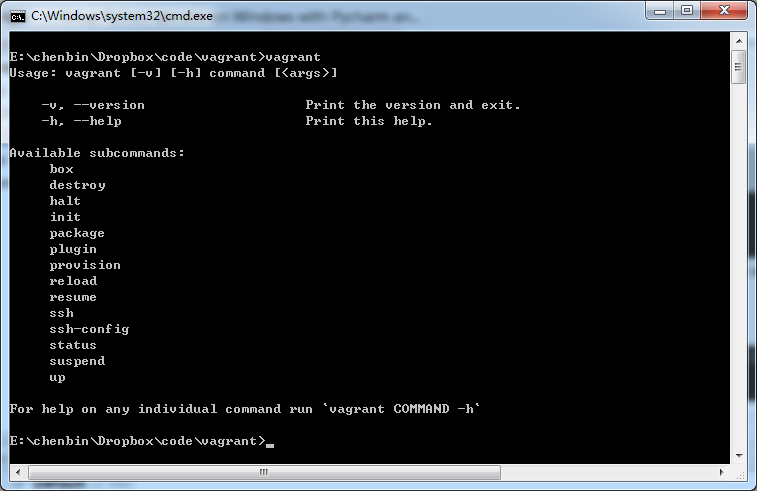
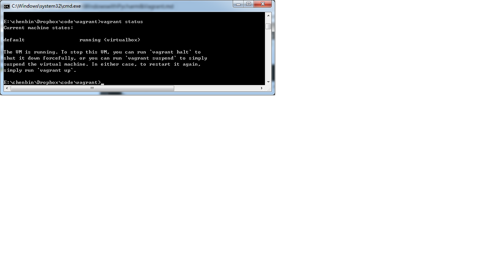

This is a guide for setup python dev env on windows (win7_x64) with
pycharm (2.7.2) and vagrant(1.2.2).

Install the software
============

    virtural box
    vagrant
    pycharm

Configure for vagrant
============

After vagrant setup,your cmd should like below.

UP AND RUNNING

    vagrant init precise32 http://files.vagrantup.com/precise32.box
    vagrant up

After running the above two commands, you'll have a fully running virtual machine in VirtualBox running Ubuntu 12.04 LTS 32-bit. You can SSH into this machine with 'vagrant ssh', and when you're done playing around, you can remove all traces of it with vagrant destroy.

After vagrant up,your cmd should like below.

vagrant file
-----------

some changes of need,completed [vagrantfile](vagrant/Vagrantfile)

add share folder between host and guest

    config.vm.synced_folder "../vcode", "/vcode"

change memory of virtual box

    vb.customize ["modifyvm", :id, "--memory", "1024"]

default port of flask.,add lines of you need.

    config.vm.network :forwarded_port, guest: 5000, host: 5000

Ubuntu and python evn setup
-----------

for ubuntu and python setup ,please read this artilce [Ubuntu Setup](ubuntu/setup.md)
